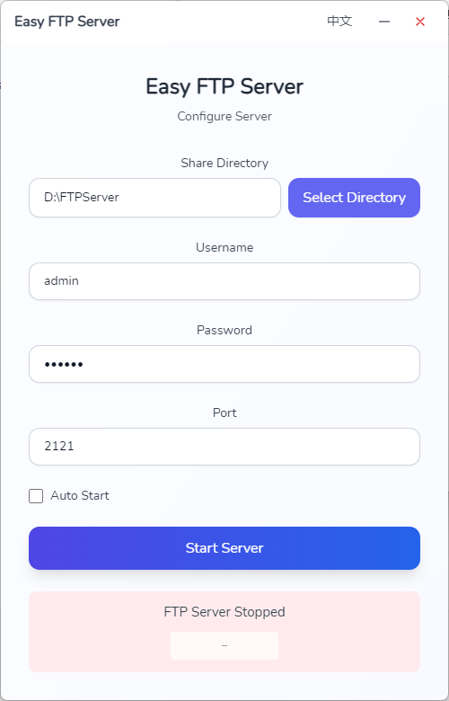

# 🚀 Easy FTP Server

[English](README.md) | [中文](README_ZH.md)

> Tired of setting up FTP servers?
> 
> Frustrated with complex configurations?
> 
> Confused by command-line operations?
>
> Don't worry, Easy FTP Server is here! 🎉

## 😎 What is this?

This is a **super simple** FTP server!

- ✨ 3-second setup, one-click start
- 🎯 No complex commands to remember
- 🔒 Built-in user authentication, secure and reliable
- 🎨 Clean interface, foolproof operation
- 🔄 Support auto-start, worry-free

It's that simple! Choose a directory, set a password, click start, done! 🚀

## 💫 Interface Preview



## 🛠️ Open Source Credits

This project is built upon these excellent open source projects:

- [Wails](https://wails.io/) - The Go framework for building cross-platform desktop apps
- [React](https://react.dev/) - The library for web and native user interfaces
- [Tailwind CSS](https://tailwindcss.com/) - A utility-first CSS framework
- [goftp/server](https://github.com/goftp/server) - A FTP server implementation in Go
- [systray](https://github.com/getlantern/systray) - Cross-platform system tray implementation
- [go-ole](https://github.com/go-ole/go-ole) - Go bindings for Windows COM
- [vite](https://vitejs.dev/) - Next generation frontend tooling

Special thanks to these amazing projects that made this simple FTP server possible!

## 🎯 Requirements

- Windows 7+ (64-bit)

## 🗺️ Roadmap

- [x] Windows version release
- [ ] ⭐️ 100 stars - Mac version support
- [ ] More features coming with your suggestions!

## 🚀 Quick Start

### Download

You can download the latest pre-built binaries from the [Releases](https://github.com/shitiandmw/easy-ftp-server/releases) page.

| Platform | Architecture | Download |
|----------|-------------|----------|
| Windows | 64-bit | [EasyFTPServer-windows-amd64.zip](https://github.com/shitiandmw/easy-ftp-server/releases/latest/download/EasyFTPServer-windows-amd64.zip) |

### User Guide

1. Download the latest version
2. Double click to run
3. Set share directory and password
4. Click start
5. Perfect! 🎉

### Development Guide

#### Environment Setup

```bash
# Make sure you have installed
- Go 1.18+
- Node.js 14+
- npm or yarn
- Wails CLI
```

#### Development Mode

```bash
# Install frontend dependencies
cd frontend
npm install

# Start development server
cd ..
wails dev
```

#### Build

```bash
# Generate release version
wails build
```

## 🤝 Contributing

PRs are welcome! But before that, please ensure:
1. Your code is simple (we love simplicity!)
2. Your code is elegant (we love elegance too!)
3. You're in a good mood (this is the most important!)

## 📝 License

MIT - Use it freely, just give us a star! ⭐️

## 🤔 FAQ

Q: Why is this project so simple?
A: Because simplicity is beautiful!

Q: Will this project stay this simple?
A: Yes, we will continue to keep it simple!
