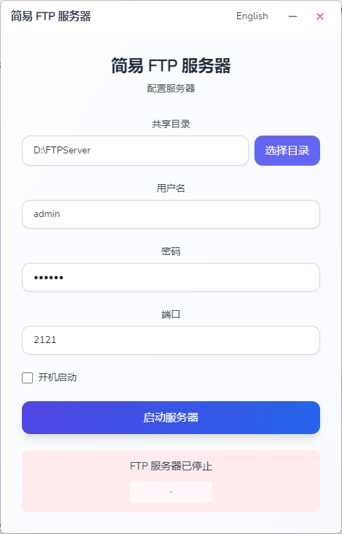

# 🚀 简易 FTP 服务器

[English](README.md) | [中文](README_ZH.md)

> 还在为搭建 FTP 服务器头疼吗？
> 
> 还在为复杂的配置抓狂吗？
> 
> 还在为命令行操作犯愁吗？
>
> 别担心，Easy FTP Server 来啦！ 🎉

## 😎 这是什么？

这是一个**超级简单**的 FTP 服务器！

- ✨ 三秒配置，一键启动
- 🎯 无需记忆复杂命令
- 🔒 内置用户认证，安全可靠
- 🎨 清爽的界面，傻瓜式操作
- 🔄 支持开机自启，省心省力

就是这么简单！选个目录，设置个密码，点击启动，搞定！ 🚀

## 💫 界面预览



## 🛠️ 开源项目引用

本项目使用了以下优秀的开源项目：

- [Wails](https://wails.io/) - 用于构建跨平台桌面应用的 Go 框架
- [React](https://react.dev/) - 用户界面构建框架
- [Tailwind CSS](https://tailwindcss.com/) - 实用优先的 CSS 框架
- [goftp/server](https://github.com/goftp/server) - Go 实现的 FTP 服务器
- [systray](https://github.com/getlantern/systray) - 跨平台系统托盘实现
- [go-ole](https://github.com/go-ole/go-ole) - Go 语言的 Windows COM 接口
- [vite](https://vitejs.dev/) - 现代前端构建工具

感谢这些优秀的开源项目，没有它们就没有这个简单好用的 FTP 服务器！

## 🎯 环境要求

- Windows 7+ (64位)

## 🗺️ 路线图

- [x] Windows 版本发布
- [ ] ⭐️ 100 stars - Mac 版本支持
- [ ] 更多功能等你来提！

## 🚀 快速开始

### 用户指南

1. 下载最新版本
2. 双击运行
3. 设置共享目录和密码
4. 点击启动
5. 完美！🎉

### 开发指南

#### 环境准备

```bash
# 确保已安装
- Go 1.18+
- Node.js 14+
- npm 或 yarn
- Wails CLI
```

#### 开发模式

```bash
# 安装前端依赖
cd frontend
npm install

# 启动开发服务器
cd ..
wails dev
```

#### 打包发布

```bash
# 生成发布版本
wails build
```

## 🤝 贡献代码

欢迎提交 PR！不过在此之前，请确保：
1. 你的代码足够简单（我们喜欢简单！）
2. 你的代码足够优雅（我们也喜欢优雅！）
3. 你的心情足够愉快（这个最重要！）

## 📝 开源协议

MIT - 随便用，记得给个星星就行！⭐️

## 🤔 常见问题

Q: 这个项目为什么这么简单？
A: 因为简单就是美！

Q: 这个项目会一直这么简单吗？
A: 是的，我们会持续保持简单！

---

如果你觉得这个项目还不够简单，请告诉我们！